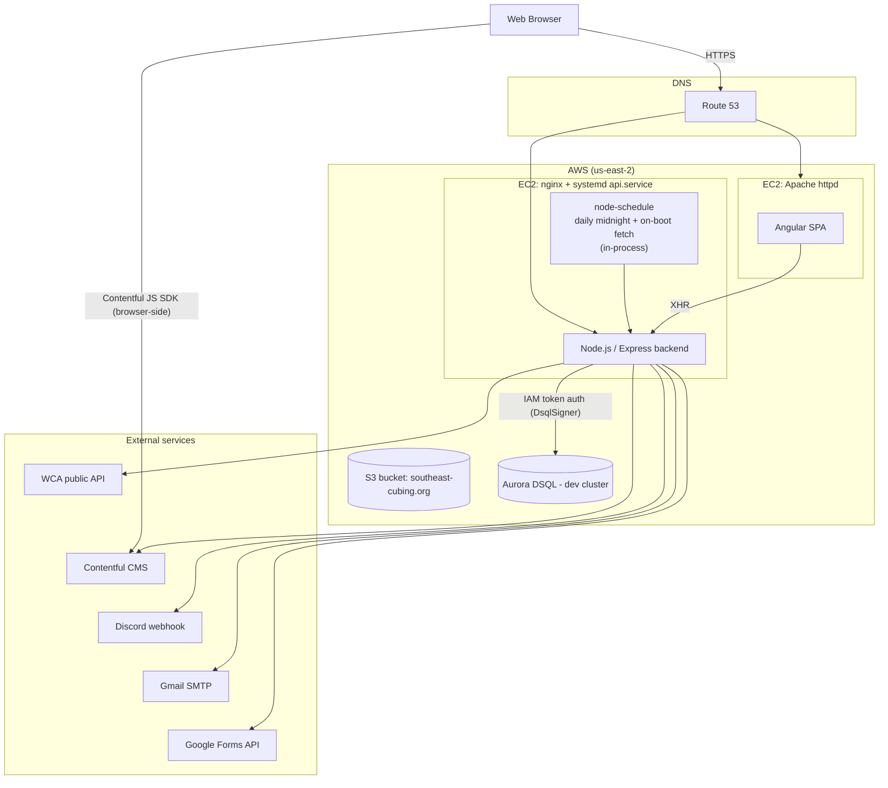

# Architecture

This is a living diagram of `SoutheastCubing.org`'s system architecture. It's
tracked in git (unlike `docs/`, which is local-only) and should be kept in
sync with the codebase — see the "Keeping this up to date" note at the
bottom, and `.github/copilot-instructions.md`.

For a snapshot of the architecture before the `docs/stories/`-driven work
began, see `docs/original-architecture-diagram.md` (local-only, not tracked
by git).

## Key characteristics today

- **pnpm workspace**, two packages: `frontend/` (Angular) and `backend/`
  (Express), each with its own dev/build/lint scripts, sharing root-level
  Prettier/ESLint config.
- **Competitions data lives in Aurora DSQL** (`backend/db/pool.js`, IAM
  token auth, no password) — `backend/aws.js` and the old S3
  `competitions.json` blob are gone from the code entirely.
  **This is proven against the dev cluster only** — the production backend
  hasn't been cut over yet, so the currently _deployed_ production backend
  may still be running the pre-DSQL, S3-based build until that cutover
  deploy happens.
- **Frontend hosting/deploy is unchanged from the original snapshot:** still
  a full EC2 instance running Apache, still the zip → public-ACL S3 → SSH +
  `wget` → unzip manual runbook (a planned move to private S3 + CloudFront
  hasn't landed yet).
- **The backend still authenticates to AWS via a static IAM access
  key/secret**, not an EC2 instance role. DSQL access itself is
  IAM-token-based (`@aws-sdk/dsql-signer`), but that's a separate concern
  from which AWS credentials the process runs as.
- **The frontend talks to Contentful directly from the browser**
  (`frontend/src/app/services/contentful.service.ts`, the `contentful` JS SDK)
  for page content, delegate/organizer entries, and the runtime links-override
  entry (`LinksService.pullLinksFromContentful()`). This is independent of the
  backend's own Contentful integration (`backend/contentful.js`), which is used
  for competitions data only.
- **Security hardening added since the original snapshot:** `helmet()`,
  a request body size limit, a tightened CORS allow-list, rate limiting on
  `/email` and `/update-competitions`, and sanitization of
  Contentful/WCA-sourced data before it reaches Discord messages, email
  headers, or the `safeUrl` pipe.
- **Discord announcements** now use pattern-based `@everyone` pings (SE
  Championship, and any SE-hosted or supplementally-detected Nats/NAC/Worlds
  match — `backend/majorChampionships.js`, `backend/db/discordPingPatterns.js`)
  alongside the original per-state role pings, with rate-limit-safe chunked
  posting (`backend/discord.js`).

## Known near-term changes (not yet reflected above)

These changes are planned but not yet implemented; each will change this
diagram when it lands:

- Provision a production Aurora DSQL cluster and cut the deployed backend
  over to it (closing the dev/prod gap noted above).
- Replace the backend EC2 instance to reduce cost/modernize the runtime.
- Replace the backend's static IAM access key/secret with an EC2 instance
  role.
- Clean up the S3 bucket's permissions and delete the now-orphaned
  `competitions.json` object.
- Move frontend hosting off the Apache EC2 instance onto a private S3
  bucket behind CloudFront (Origin Access Control, no more public-ACL
  deploys), retiring that instance entirely.

## Keeping this up to date

Update this diagram whenever a change alters the system's architecture —
new AWS resources, a new external integration, a hosting/deploy path change,
a new data store, etc. This includes each time one of the planned changes
listed above lands.
